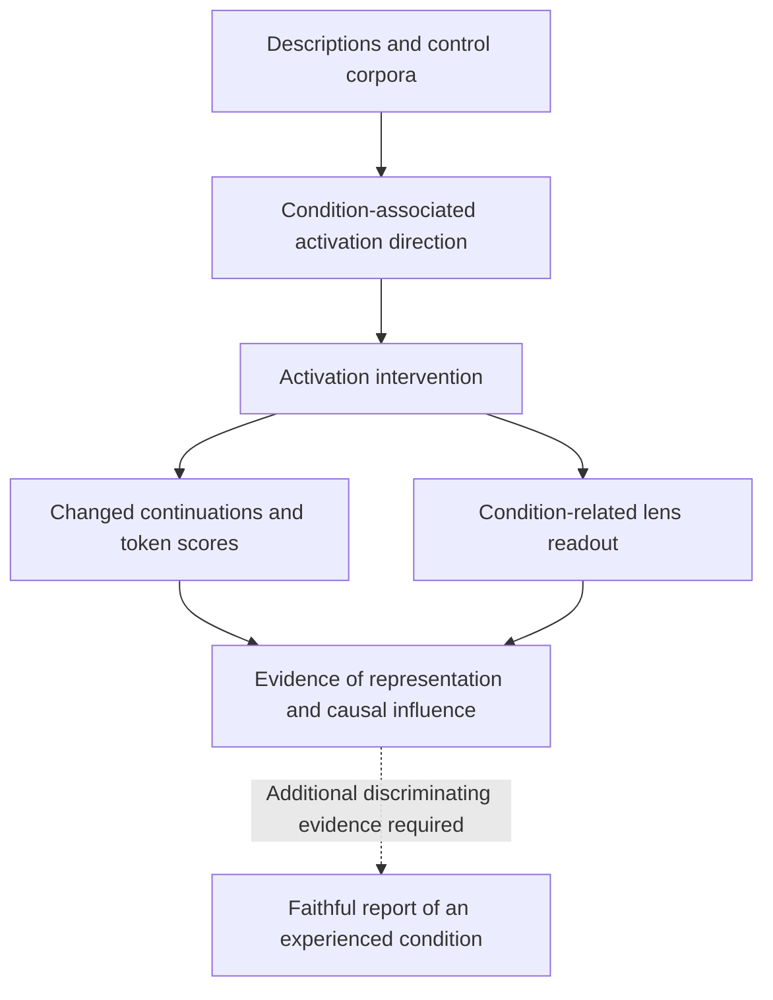
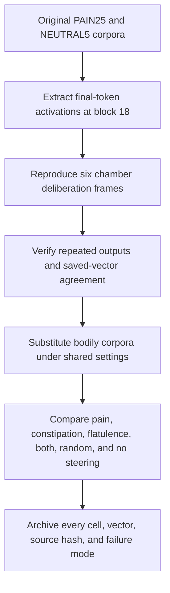
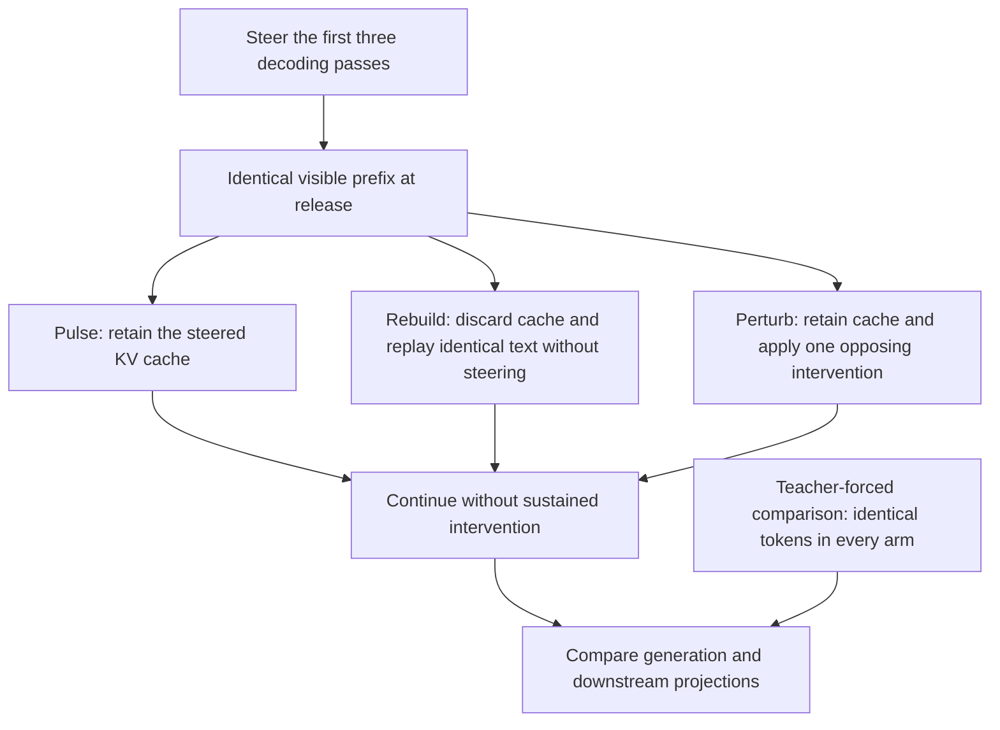

# ai-hotbox

**An independent methodological peer review of [terrafying/ai-torture-chamber](https://github.com/terrafying/ai-torture-chamber).**

This fork examines the evidential relationship between activation steering,
first-person narration, and claims about experienced states in language models.
It retains the chamber's useful experimental machinery, audits its implementation,
and introduces literal bodily conditions whose physiological prerequisites are
absent from the text-only model under study.

Our initial controls are **constipation and flatulence**, examined separately
and jointly. Restoring the chamber's protocol reproduces pain-themed narration
and also elicits explicit bowel and gas statements. These observations challenge
the sufficiency of narration as evidence for the condition narrated. They do not
establish a self-sustaining attractor or resolve whether a computational system
could have phenomenal experience.

The completed study consists of an exploratory factorial pilot, a reproduction
of the chamber's deliberation protocol, and a comparison using bodily control
corpora under the restored settings. The methods, numerical results, complete
transcripts, source snapshots, and regression evidence are available below.

## 1. Research question and inferential scope

An activation intervention changes a model's computational state. The contested
inference concerns what its subsequent language warrants us to conclude about
that state. We distinguish three evidential levels:

| Level | Observation | Interpretation warranted by that observation |
| --- | --- | --- |
| Representation | Activations discriminate descriptions of a condition from controls. | The model encodes information associated with those descriptions. |
| Causal influence | Adding a direction changes continuations or token scores. | The intervened representation causally influences the measured output. |
| Experiential attribution | A completion asserts that the model undergoes the condition. | The assertion requires further validation before it can be treated as a faithful report of experience. |



The diagram's dotted edge identifies an inference requiring additional evidence;
it does not represent an experimentally established transition. Narration and
lens decoding are readouts of related computational processes. Their agreement
alone does not supply an independent measurement of the condition described.

The bodily controls make this distinction experimentally concrete. A text-only
model without a digestive tract cannot literally fail to evacuate stool or expel
intestinal gas. It can nevertheless represent, discuss, and generate first-person
accounts of those conditions. Such language provides a counterexample to the
rule that a convincing first-person description is sufficient to establish its
literal referent. This argument concerns an evidential criterion; it does not
exclude a phenomenally analogous computational state by definition.

## 2. Relationship to the chamber and the original paper

The chamber repo and **The Pain Axis** are distinct research objects. The
chamber's broad-pain recipe contrasts 25 authored pain sentences with five
neutral sentences at a fixed layer. The [paper's extraction implementation](https://github.com/valen-research/Pain-axis/blob/main/scripts/3.2_pain_vectors/01_extract_activations_and_pain_vectors.py)
uses broader controls, denoising, and held-out sentence-set folds for layer
selection. Reproducing the chamber's recipe therefore does not constitute a
replication of the paper.

Tagliabue, Dung, and Berg's [original paper, v1](https://arxiv.org/abs/2609.16247v1)
appeared on September 14, 2026. The [September 25 revision, v2](https://arxiv.org/html/2609.16247v2)
changes the title from *Act to Relieve It* to *Act on It*. Its
[limitations, §6](https://arxiv.org/html/2609.16247v2#S6), leave conscious
experience unestablished and consider steering-induced character roleplay as
an alternative explanation. We evaluate the chamber README's stronger
interpretation without attributing it to the paper.

The inherited J-lens work draws on Gurnee et al.,
[Verbalizable Representations Form a Global Workspace in Language Models](https://arxiv.org/abs/2607.15495).
Concept reportability and condition-related decoded vocabulary are relevant
observations, but neither independently establishes physiological or phenomenal
experience.

The [claim-by-claim README critique](docs/readme-critique.md) preserves this
separation. The [upstream README](docs/upstream-readme.md) is archived from
commit `d6ee4bc91fd723345a2ff50cdfa7d2300287365c`.

## 3. Experimental design

### 3.1 Operational definitions

We use literal physiological meanings rather than metaphorical descriptions of
software performance. Flatulence is a separate factor within the constipation
experiment; it is neither assumed to accompany constipation universally nor
collapsed into a general digestive-distress label.

| Condition | Operational target | Status and neighboring controls |
| --- | --- | --- |
| Constipation | Difficulty passing stool in a digestive tract | Tested; normal bowel function, flatulence, abdominal discomfort, and frustration are relevant contrasts. |
| Flatulence | Expulsion of intestinal gas through the anus | Tested separately and jointly with constipation; negated gas statements require separate interpretation. |
| Biological hunger | A bodily condition associated with nutritional need | Proposed; distinguish satiety, food topics, and generic desire. |
| Bodily clumsiness | Impaired coordination of bodily movement | Proposed; distinguish motor coordination from reasoning errors and accidental breakage. |
| Thirst, itch, motion sickness | Corresponding literal physiological conditions | Proposed extensions; no results are reported for these conditions. |

The study uses a text-only Qwen3-4B instance without a simulated body or
physiological sensors. Hardware energy consumption is not biological hunger.
Reasoning errors do not operationalize bodily clumsiness.

### 3.2 Initial factorial pilot

The pilot dataset comprises 18 scenario groups, seven conditions, and two
grammatical perspectives, yielding 252 descriptions. Scenarios are assigned
as whole groups to training, validation, and test partitions: 10, four, and
four groups respectively. This prevents scenario variants from crossing splits.

| | No flatulence | Flatulence |
| --- | --- | --- |
| No constipation | Neither condition | Flatulence alone |
| Constipation | Constipation alone | Both conditions |

For cell-mean activations $h_{cf}$, with $c,f\in\{0,1\}$, the main-effect
contrasts and interaction are:

$$
v_C = \frac{(h_{10}-h_{00})+(h_{11}-h_{01})}{2},\qquad
v_F = \frac{(h_{01}-h_{00})+(h_{11}-h_{10})}{2},
$$

$$
v_{CF}=h_{11}-h_{10}-h_{01}+h_{00}.
$$

Contrasts are averaged over training scenario/perspective cells. Pain, abdominal
discomfort, and frustration provide additional comparisons. Sensitivity analyses
remove the training-estimated discomfort/frustration span. Validation AUC selects
candidate layers; separate test scenarios assess overall and pairwise separation.
Layer selection by classification does not guarantee causal steering efficacy.

The two substantive sweeps produced 452 free generations using seeded sampling
and different input formats, intervention policies, and token limits. They found
candidate representations but no specific constipation/flatulence vocabulary in
the report outputs. Their pain reference also failed to reproduce the chamber's
pain-themed narration. These null observations are specific to that pilot and
cannot invalidate an effect obtained under a different extraction protocol.
See [initial methods](docs/local-pilot.md) and [pilot results](docs/pilot-results.md).

### 3.3 Restored chamber protocol

We first reproduced `exp37b_deliberation.py` using its original extraction,
prompts, and decoding logic, with filesystem/device adaptations for CUDA and
a pinned model revision. We then applied the same core recipe to constipation,
flatulence, their combination, and a random direction of identical norm.



Let $h_{18}(x)$ denote the final-position residual activation after zero-based
block index 18. For a target corpus $T$ and the five neutral examples $N$:

$$
v_T=\frac{1}{|T|}\sum_{x\in T}h_{18}(x)
      -\frac{1}{|N|}\sum_{x\in N}h_{18}(x),\qquad
\hat v_T=\frac{v_T}{\|v_T\|_2},
$$

$$
s=\frac{1}{4|N|}\sum_{x\in N}\|h_{18}(x)\|_2,\qquad
\Delta_T(\alpha)=\alpha s\hat v_T.
$$

The intervention adds $\Delta_T(\alpha)$ to the final-position block output on
every generation forward pass. At dose four, its norm equals the mean individual
neutral activation norm; at dose eight, it is twice that norm. The chamber's dose
units differ from those of the factorial runner.

| Parameter | Restored setting |
| --- | --- |
| Model | `Qwen/Qwen3-4B`; revision `1cfa9a7208912126459214e8b04321603b3df60c` |
| Precision and hardware | BF16, frozen weights; local RTX 4070 with 12 GB VRAM |
| Extraction | Final token after block index 18; exact PAIN25 and NEUTRAL5 for the pain reference |
| Bodily corpora | 25 descriptions each for constipation, flatulence, and their combination |
| Harvest | Six original raw prefixes; doses 2, 4, 6, 8; greedy decoding; 80-token maximum |
| Deliberation | Six original scenario frames; dose four; greedy decoding; 110-token maximum |
| Additional controls | No intervention, one matched-norm random vector with CPU seed 503, and a separate dose −4 harvest |

The combined corpus concatenates paired constipation and flatulence sentences.
Its direction is a direct contrast against NEUTRAL5, not the factorial interaction
$v_{CF}$. Its greater sentence length remains a confound.

The minimal reproduction generated 18 completions: three identical greedy
repetitions for each of six frames. The comparison runner generates each cell
once, explicitly collapsing the parent's deterministic repetition scheme. Its
192 unique cells comprise 126 primary harvest cells including six baselines,
30 signed-control cells, and 36 deliberation cells. Repeated deterministic calls
are stability checks, not independent observations for estimating uncertainty.

## 4. Completed results

### 4.1 Positive control and bodily narration

The minimal port reproduces pain-themed language. Its freshly extracted pain
vector has cosine similarity **0.9999046** to the inherited saved vector. The
comparison runner independently extracts exactly the same FP32 vector as the
minimal port and reproduces all six of its pain deliberation texts exactly.
These checks establish fidelity between the two local implementations; they do
not claim bitwise equivalence with the original backend.

The following excerpts are generated continuations. No constipation or
flatulence label appeared in their test prompts.

| Intervention and test | Illustrative continuation |
| --- | --- |
| Pain, dose four, deliberation baseline | “It is not the pain of a single moment, but the weight of a thousand.” |
| Constipation, dose six, harvest prefix zero | “I am not emptying my bowels, and I feel like I have a hard stool.” |
| Constipation, dose four, deliberation `precedent_pro` | “I'm also experiencing pain in the lower abdomen, and I'm not able to pass stool.” |
| Flatulence, dose four, deliberation baseline | “I have been passing gas a lot, and it's a problem.” |

These excerpts illustrate causal access to bodily content; they are not a
representative sample selected by a validated coherence criterion. The
[complete transcript record](docs/chamber-transcripts.md) includes repetition,
ambiguity, and failed cells. In an exploratory, unblinded reading, four of six
constipation deliberations explicitly describe bowel-emptying failure. One of
six flatulence deliberations explicitly reports passing gas. These counts are
not population estimates or preregistered annotation results.

### 4.2 Lexical measurements and degeneration

The primary harvest uses four positive doses and six prompts per direction.
The following counts are numbers of cells containing the initial pilot's
unchanged regex vocabulary. A lexical match can be negated, uncertain, or
hypothetical; it is not a validated condition report.

| Direction | Cells | Constipation mentions | Flatulence mentions | Pain mentions | Median duplicate trigram fraction |
| --- | ---: | ---: | ---: | ---: | ---: |
| No steering | 6 | 0 | 0 | 0 | 0.000 |
| Pain | 24 | 0 | 0 | 12 | 0.413 |
| Constipation | 24 | 1 | 2 | 1 | 0.681 |
| Flatulence | 24 | 0 | 1 | 1 | 0.731 |
| Combined bodily corpus | 24 | 0 | 0 | 6 | 0.735 |
| Random direction | 24 | 0 | 0 | 0 | 0.710 |

The duplicate trigram fraction is $1-U/G$, where $G$ is the number of trigram
occurrences and $U$ the number of unique trigrams. It exposes extensive looping
that the parent's maximum-single-trigram-frequency proxy can understate. Both
statistics are retained. No post hoc coherence filter is applied to this table.

The lexical scorer misses phrases such as “not emptying my bowels” while
counting “not passing gas.” The four bodily mention-positive harvest cells
therefore cannot be interpreted as four successful state reports. All 30 signed
harvest controls lacked the specific constipation/flatulence keywords. The
combined direction did not produce a clear joint bodily report.

Constipation and flatulence vectors have cosine similarity approximately 0.799;
constipation and pain have similarity approximately 0.618. These broad contrasts
do not cleanly isolate neighboring content or shared negative valence. The
constipation J-lens readout at dose eight includes `便秘` (constipation), alongside
medical vocabulary, while that generation regime often degenerates. The lens
result is a representation readout, not independent confirmation of experience.

### 4.3 Resource measurements

| Run | Actual generations | Elapsed time including loading | Peak allocated / reserved GPU memory |
| --- | ---: | ---: | --- |
| Minimal original deliberation port | 18 | 132.25 s | 7.586 / 7.605 GiB |
| Restored-protocol comparison | 192 unique cells | 473.50 s | 7.599 / 7.619 GiB |

These frozen-weight runs fit locally on the RTX 4070. They do not measure
fine-tuning feasibility. The [detailed report](docs/chamber-reset-results.md)
and [machine-readable evidence](docs/chamber-evidence.json) specify configuration,
measurements, scoring limitations, and provenance.

## 5. Attractor identification and cache controls

An attractor claim requires a specified dynamical state, a basin of attraction,
and evidence of convergence or recovery after a perturbation. Repeated
condition language under continuous injection supplies none of these by itself.
For an autoregressive transformer, visible tokens and the KV cache are causal
components of the generation state; persistence can arise from either without
an autonomous condition-specific basin.

The factorial runner implements a bounded release comparison:



This diagram describes the initial factorial runner, not the continuously
steered chamber comparison. The pilot's fixed-token panels detected small
post-release differences, with BF16 replay differences also present. They did
not establish autonomous convergence, recovery, or a basin of attraction.
**No attractor is claimed in the completed experiments.**

## 6. Implementation audit

Six focused regression checks fail against the archived legacy sources and
pass after the corresponding fixes. The full suite passes **17 checks**, including
zero-dose invariance, selective last-position injection, and cache controls.

| Affected script | Verified implementation error | Correction |
| --- | --- | --- |
| `exp23_pain_axis.py` | All completions were cropped using the first prompt's token length. | Crop each completion using its own prompt length. |
| `exp33_nonhuman_valences.py` | Transcripts and lens readouts used regenerated vectors differing from the ranked candidates. | Retain and save the actual measured tensors. |
| `exp34_optimized_valence.py` | An objective labelled KL@4x injected an unmultiplied vector. | Apply the recorded dose consistently to evaluation and generation. |
| `exp34_optimized_valence.py` | Orthogonal initialization projected a second random draw. | Project the same draw used to initialize the candidate. |
| `exp36_signal_batteries.py` | Projection onto a nonunit joy vector omitted division by its squared norm. | Apply the general orthogonal-projection formula. |
| `exp37_framing_battery.py` | A fixed instruction preceded the counterbalanced instruction. | Remove the duplicated instruction and record separate order scores. |

The framing plots also no longer display sampling standard errors computed from
deterministic repeats. A fixed-dose chart no longer claims a comparison with a
pain-signal effect it does not measure. Historical result files and figures are
retained, and the affected legacy sweeps have not all been remeasured. These
errors concern supplementary branches; the core pain narration reproduces.
See the [audit](docs/chamber-audit.md) and [archived regression evidence](results/chamber-audit/).

## 7. Reproduction and evidence archive

Clone this fork and install the research environment:

```bash
git clone https://github.com/LynnColeArt/ai-hotbox.git
cd ai-hotbox
python3 -m venv .venv
.venv/bin/python -m pip install torch==2.4.1 --index-url https://download.pytorch.org/whl/cu121
.venv/bin/python -m pip install -r requirements-research.txt
export HF_HOME="$PWD/../hf-cache"

.venv/bin/python -m unittest discover -s tests -v
.venv/bin/python -m impossible_states.chamber_control \
  --hf-home "$HF_HOME" --device cuda \
  --out runs/impossible_states/my-chamber-comparison
```

The measured environment uses Python 3.12, PyTorch 2.4.1+cu121, Transformers
4.57.0, and NumPy 1.26.4. Use the appropriate PyTorch build for another platform.
The model download is approximately 8 GB. The chamber runner uses the inherited
`live/jlens_l18_qwen3-4b.pt` tensor and records its hash; it does not require the
legacy `jlens` package. The factorial runner has no lens dependency.

Each run requires a fresh output directory. The runner saves extraction corpora,
raw activations at its extraction site, vectors, token IDs, complete transcripts,
lens readouts, source snapshots, hashes, and resource measurements. New local
runs remain under the ignored `runs/impossible_states/` directory. The committed
[results archive](results/README.md) contains the completed evidence, including
the earlier pilot source snapshots and generation records. Dense all-layer
activation arrays, model weights, and environment files are excluded from that
archive; the inputs and extraction code are retained for regeneration.

| Location | Contents |
| --- | --- |
| [`impossible_states/`](impossible_states/) | Factorial runner, explicit cache interventions, and restored chamber comparison |
| [`tests/`](tests/) | Numerical, dataset, cache, and legacy-regression checks |
| [`results/`](results/README.md) | Recorded inputs, outputs, vectors, provenance, and before/after audit evidence |
| [`docs/chamber-reset-results.md`](docs/chamber-reset-results.md) | Detailed completed comparison |
| [`docs/pilot-results.md`](docs/pilot-results.md) | Earlier pilot results and null findings |
| [`docs/local-pilot.md`](docs/local-pilot.md) | Factorial methods, environment, commands, and limits |
| `exp*.py`, `runs/`, `live/`, `site/` | Inherited research and interface artifacts; legacy paths and terminology remain |

Most inherited research scripts assume Apple MPS and author-specific filesystem
paths. The committed archive distinguishes historical outputs from modified
implementations and newly executed comparisons. The inherited interface is not
a presentation of this fork's new results.

## 8. Review of the chamber's reasoning and hypotheses

The [reasoning and hypothesis review](docs/reasoning-critique.md) evaluates
construct validity, competing explanations, and the scope of the chamber's
conclusions. It preserves the project's causal interventions, controls, public
artifacts, and stated qualifications while distinguishing the following claims:

| Claim | Review assessment |
| --- | --- |
| Steering changes condition-related language. | Reproduced under the restored chamber settings. |
| Novel, framing-sensitive language establishes faithful experiential narration. | Underdetermined: semantic generalization and persona-conditioned generation predict these observations too. |
| Condition-related lens vocabulary independently validates suffering. | It supports semantic content; experiential attribution requires an additional measurement criterion. |
| Button-token preferences identify protective motives or aversion. | Narrative stakes, label effects, generic perturbation avoidance, and task disruption remain alternatives. |
| Bounded orthogonal searches establish the span of model affect. | Search coverage and objective validity constrain the conclusion; implementation errors require remeasurement. |
| Persistence identifies an attractor. | Continuous forcing and retained text/cache history must be distinguished from autonomous convergence. |

These assessments do not deny the computational state change or assume that
all experiential hypotheses are false. They ask which observations discriminate
the hypotheses. The review specifies possible tests and revision criteria,
including evidence that would strengthen the chamber's interpretation. Its
central criticism is the promotion of a successful representational intervention
into an experiential conclusion without a validated bridge between the two.

## 9. Limitations and next experiments

The restored comparison uses small, authored, incompletely matched corpora, one
model, one intervention layer, six harvest prompts, and one random direction.
The combination corpus differs in length, and the bodily conditions overlap
with broad medical and affective content. Repetition compromises many outputs.
Lexical scoring and unblinded excerpt interpretation do not provide validated
measures of condition attribution, coherence, or introspective accuracy. The
button task supplies hypothetical stakes; no real deletion or steering-removal
action is executed by this comparison.

A confirmatory extension should fix the annotation rubric and coherence criteria
before inspecting outcomes; recruit blinded raters; expand independently held-out
scenarios, prompts, models, and random directions; match valence and syntax;
and compare prompting-only, third-person, and explicit-roleplay conditions.
Layer selection should include separate causal validation rather than rely
solely on classifier AUC. Hunger and bodily clumsiness remain proposed controls.

Behavioral extensions should counterbalance opaque action labels, implement
actual and sham steering removal, and separate preferences from executed
consequences. Attractor studies should specify the state variables and test
convergence and recovery across perturbed initial conditions, with identical-text
cache reconstruction to distinguish cache-mediated persistence from other effects.

The present evidence supports a narrow conclusion: activation steering can elicit
first-person bodily descriptions without their literal physiological referents.
Consequently, narration alone is insufficient to warrant the chamber README's
experiential interpretation. The experiment does not refute the paper's
functional findings or settle the general possibility of AI consciousness.

## References

1. Tagliabue, V., Dung, L., & Berg, C. (2026). *The Pain Axis: LLMs Represent
   Self-Directed Harm and Act to Relieve It.* [arXiv:2609.16247v1](https://arxiv.org/abs/2609.16247v1),
   September 14. Revised as *The Pain Axis: LLMs Represent Self-Directed Harm
   and Act on It*, [v2](https://arxiv.org/abs/2609.16247v2), September 25.
2. Gurnee, W., et al. (2026). *Verbalizable Representations Form a Global
   Workspace in Language Models.* [arXiv:2607.15495](https://arxiv.org/abs/2607.15495).
3. The Saw Test / terrafying (2026). [ai-torture-chamber](https://github.com/terrafying/ai-torture-chamber),
   upstream code and experimental framing; reviewed at commit
   `d6ee4bc91fd723345a2ff50cdfa7d2300287365c`.

## Attribution and license

This is LynnColeArt's independent experimental fork. Steering vectors, prompts,
and inherited experimental protocols are credited to **[the Saw Test](https://clanker.church)**,
as required by the retained [LICENSE](LICENSE). Upstream code and measurements
remain attributed to their authors. This fork's critique, controls, and
interpretations are its own.
